  

<h3><code>$ whoami --verbose</code></h3>

<table>
  <tr>
    <td valign="top"></td>
    <td valign="top"></td>
  </tr>
</table>

 

<h3><code>$ ./id_card.sh &amp;&amp; gh stats</code></h3>

<table>
  <tr>
    <td valign="middle" rowspan="2"></td>
    <td valign="top"></td>
  </tr>
  <tr>
    <td valign="top"></td>
  </tr>
</table>

 

<h3><code>$ gh trophies</code></h3>

  

<h3><code>$ cat contributions.log</code></h3>

 

  

<h3><code>$ ./connect.sh</code></h3>

  

